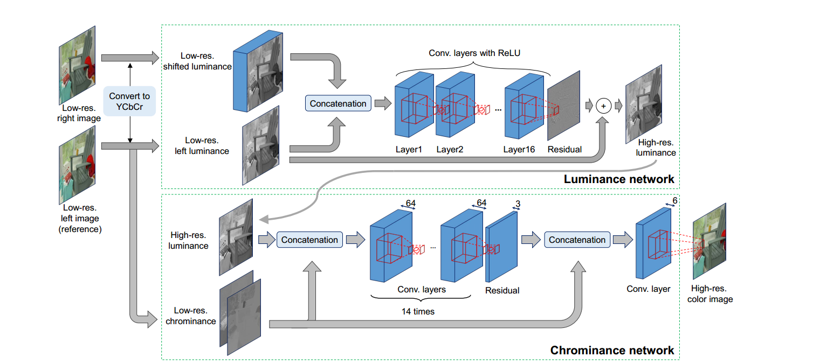

### 

论文要解决的问题是图像空间超分辨，主要的想法是通过双目视觉的视差先验实现图像的亚像素精度空间超分辨。

文章整体的思路比较清晰，首先将RGB转换到$Yc_bc_r$空间，以分别处理亮度(luminance)和色度(chrominance),。网络由两个子网络组成，第一个网络处理Y通道，得到高分辨率的Y通道图像，第二个处理$C_b$和$C_r$通道，得到高分辨率的彩色图像。

问题：

1.视差先验(parallax prior)是怎么体现的？
2.在文章结果部分有和VDSR对比的实验结果，但VDSR是SISR，此处使用stereo的两张图像，这么比公平吗？
3.Psycho的stereo方法甚至不如VDSR，这。。。。
4.在处理第一个网络的输入时，是把right image进行pixel shift，平移n个pixel，但是每个点对应的偏移量是不一样的，这里怎么处理、

参考资料：