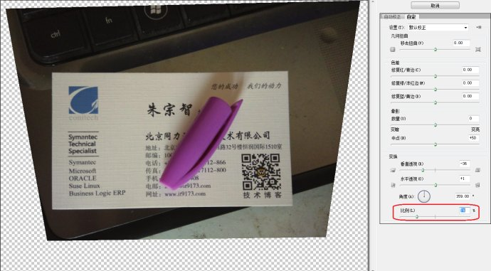

### 单应性变换(homography)

所谓单应性变换就是一个平面到另一个平面的映射关系。
<div align = center>

</div>

<!-- more -->
如图，两张图片中的相同的点叫做corresponding points,比如图中红色的两点就是一对corresponding points。单应性(homography)矩阵就是表示从一张图到另一张图的映射关系的变换矩阵。

$$
H=\begin{bmatrix}
h_{00} & h_{01} & h_{02} \\\
h_{10} & h_{11} & h_{12} \\\
h_{20} & h_{21} & h_{22}
\end{bmatrix}
$$

$$ \begin{bmatrix}
x_1 \\\ y_1 \\\ 1\end{bmatrix}=H\begin{bmatrix}x_2\\\ y_2\\\ 1\end{bmatrix}=
\begin{bmatrix}
h_{00} & h_{01} & h_{02}\\\
h_{10} & h_{11} & h_{12}\\\
h_{20} & h_{21} & h_{22}
\end{bmatrix}
\begin{bmatrix}
x_2\\\
y_2\\\
1\end{bmatrix}
$$


### 代码实现
```python
#!/usr/bin/env python

import cv2
import numpy as np
 
if __name__ == '__main__' :
 
    # Read source image.
    im_src = cv2.imread('book2.jpg')
    # Four corners of the book in source image
    pts_src = np.array([[141, 131], [480, 159], [493, 630],[64, 601]])
 
 
    # Read destination image.
    im_dst = cv2.imread('book1.jpg')
    # Four corners of the book in destination image.
    pts_dst = np.array([[318, 256],[534, 372],[316, 670],[73, 473]])
 
    # Calculate Homography
    h, status = cv2.findHomography(pts_src, pts_dst)
     
    # Warp source image to destination based on homography
    im_out = cv2.warpPerspective(im_src, h, (im_dst.shape[1],im_dst.shape[0]))
     
    # Display images
    cv2.imshow("Source Image", im_src)
    cv2.imshow("Destination Image", im_dst)
    cv2.imshow("Warped Source Image", im_out)
 
    cv2.waitKey(0)
```


### 单应性变换应用
最常见的当属于对文档进行自由变换。如使用手机拍摄文件或者明信片时，由于相机或拍摄角度等因素影响，拍摄的文档并不是矩形，而往往带有一定程度的畸变，此时可以使用单应性变换对文档进行自由变换矫正。此处从[网上](http://blog.sina.com.cn/s/blog_6965d96d0101u98s.html)扒了一个使用PS对名片进行自由变换的例子，其本质就是单应性变换的应用。

拍摄照片：
<div align = center>

</div>

PS自由变换后：
<div align = center>

</div>

另一个例子：
<div align = center>


</div>

中间时代广场左上角的广告牌被替换为"Les Horribles Cernettes"的海报。
### 参考资料
[1] https://www.learnopencv.com/homography-examples-using-opencv-python-c/
[2] https://blog.csdn.net/xuyangcao123/article/details/70916767
[3] [markdown公式指导手册](https://www.zybuluo.com/codeep/note/163962)
[4] http://blog.sina.com.cn/s/blog_6965d96d0101u98s.html