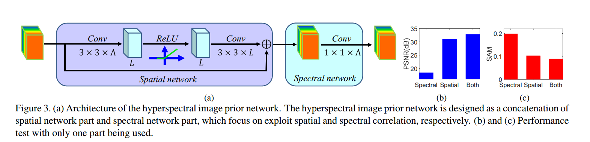
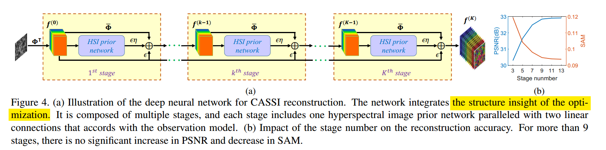

写在前面：此文发于CVPR2019

[//]:，并公布了[代码](https://github.com/JiaRenChang/PSMNet)

题目：Hyperspectral Image Reconstruction Using a Deep Spatial-Spectral Prior
作者：Lizhi Wang1 Chen Sun1 Ying Fu1 Min H. Kim2 Hua Huang1
1Beijing Institute of Technology 2Korea Advanced Institute of Science and Technology

<!--more-->

正则化是求解病态优化问题的一个基本方法，并且在高光谱图像重建中得到了广泛应用。但是以往基于正则化的方法往往需要手工设计且对变化范围大的场景不鲁棒。作者提出了一种结合数据驱动先验和基于优化网络的高光谱图像重建方案，在仿真和实物系统上达到了较高精度。

为了解决欠定重建问题，可以使用正则化引入图像先验，如全变分(TV)，sparsity,non-local similarity等正则化方法。但基于经验设计的正则化方法对多样的自然光谱图像处理能力差，需要手工微调参数且往往不能求取闭合解。作者提出近期提出的基于神经网络的压缩感知方法，LISTA,ADMM-NET,ISTA-NET等虽然可以避免迭代求解，但是仍然继承了稀疏先验这一特点，限制了一些层内的特征是稀疏的，这对于求解优化问题是不利的。同时，现有基于网络的重建方法只考虑了空间维度而忽略了光谱图维度，这相当于白白损失了一个维度的先验。

作者结合优化的内在结构(structure insight of the optimization)和神经网络出色的先验建模能力，1、首先学习先验的 正则化描述子。2、将描述子与优化方法结合表示成网络形式。

#### HQS半二次方分裂
首先需要介绍HQS算法：

有目标函数如下，其中$x$为待恢复图像。
$$
\hat{x}=\arg\min_x\frac{1}{2}\|y-Hx\|+\lambda\Phi(x)
$$

引入辅助变量$z$,
$$
\hat{x}=\arg\min_x\frac{1}{2}\|y-Hx\|^2+\lambda\Phi(z),s.t.~~z=x
$$

于是得到惩罚函数：

$$
\mathcal{L_\mu}(x,z)=\frac{1}{2}\|y-Hx\|+\lambda\Phi(z)+\frac{\mu}{2}\|z-x\|^2
$$

于是问题转化为迭代求解以下两式：

$$
x_{k+1}=\arg\min_x\|y-Hx\|+\mu\|x-z_k\|^2
$$

$$
z_{k+1} = \arg\min_z\frac{\mu}{2}\|z-x_{k+1}\|^2+\lambda\Phi(z)
$$

对应于本文要解决的压缩感知问题，当正则项不可微时，使用分离变量方法把正则项解耦出来，本文使用了HQS方法。如图1所示，对应的网络模型

图1

从公式(7)(8)的角度考虑，可HQS方法分离了观测模型$\Phi$和超参先验$R(\cdot)$，所以可以使用卷积神经网络学习一个$S(\cdot)$来代替公式(8)的求解，如图2公式：

图2

自然而然，一个卷积神经网络可以代替图2，网络结构如图3所示。

图3

此网络的优点在于：1、考虑了空间维度和光谱维度；2、简单易学好训练。

### 优化与重建结合的方法

与分离变量并进行迭代的方式相比，作者提出的方法整体考虑了观测模型和图像先验。
图1公式(7)中的f-子问题是一个最小二成问题，可以给出闭合解：

利用共轭梯度法(conjugate gradient, CG)可以求解f-子问题，易推出(11)(12),

将先验生成网络嵌入到(12)，得到下图的网络。

最终可以端到端训练进行重建。取得了STOA的结果。

### Reference
[机器学习&数据挖掘笔记_12（对Conjugate Gradient 优化的简单理解）](https://www.cnblogs.com/tornadomeet/p/3265225.html)

[HQS——Half Quadratic Splitting半二次方分裂](https://www.cnblogs.com/wxl845235800/p/10734866.html)

Learning Deep CNN Denoiser Prior for Image Restoration

