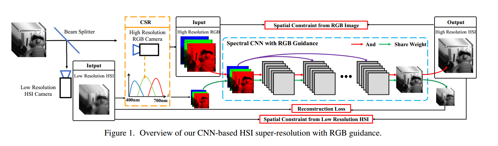

写在前面：此文发于CVPR2019。

[//]:，并公布了[代码](https://github.com/JiaRenChang/PSMNet)

题目：Hyperspectral Image Super-Resolution with Optimized RGB Guidance
作者：Ying Fu1 Tao Zhang1 Yinqiang Zheng2 Debing Zhang3 Hua Huang
1Beijing Institute of Technology 2National Institute of Informatics 3DeepGlint

<!--more-->

本文提出了非监督高光谱超分辨的网络结构，并加入了CSR优化层，去选择特定的优化。

作者提出来一种端到端的RGB引导高光谱超分辨的方法，可以有效地估计RGB空间和高光谱空间的非线性映射，并且利用了空间一致性。除此之外，作者还提出CSR优化层去根据给定的CSR数据集选择最优的CSR，甚至可以设计一个有利于优化RGB引导HSI超分辨任务的新CSR函数。

### 建模

有低分辨率HSI$X_l$，高分辨率RGB$Y$，和待恢复HSI数据$X$。因此有
$$X_l=XH,~Y=CX\tag{1}$$
其中$H$为空间下采样，$C$为CSR函数。

现有的从高分辨率RGB和低分辨率HSI回复高分辨率HSI可以表示为
$$E(X)=E_d(X,X_l,Y)+\lambda E_s(X) \tag{2}$$

$E_d$表示为根据式(1)约束的恢复$X$，$E_s(\cdot)$为先验正则，之前的工作均假定有限的材料类型从而在稀疏假设下可以线性表示。非线性光谱表达可以显著地改善高光谱恢复的精度。

### RGB引导光谱CNN

网络结构如图1 所示。

首先使用式(1)对光谱图像进行光谱维度下采样，得到低分辨率的RGB图像，后使用CNN学习低分辨率RGB到低分辨率光谱图像之间的非线性映射，与此同时，RGB加到每层的特征上用于引导空间分辨率重建。**有个疑问：既然$Y_l=CX_l$,降质过程（$C$）既然已知，为什么还要去学这个逆问题呢？**
这里为了学习到光谱信息的内在特征，使用了1*1的卷积核。Loss为MSEloss。

$$\mathcal{L}_s=\|f(Y_l,\Theta)-X_l\|^2
\tag{3}$$
由于网络参数对于高分辨率RGB是权值共享的，所以
$$X=f(Y,\Theta)\\
X_l=f(Y_l,\Theta)\tag{4}$$

又根据式(1)，高分辨率HSI 与 经过线性映射的低分辨率HSI和高分辨率RGB是具有一致性的。
所以，联合式(1)(4),可以得到
$$\mathcal{L}_d=\|Y-Cf(Y,\Theta)\|^2+\tau_1\|X_l-f(Y,\Theta)H\|^2
\tag{5}$$

最终的loss为：

$$\mathcal{L}_sd = \mathcal{L}_d(\Theta)+\tau_2 \mathcal{L}_d(\Theta)+\eta_1\|\Theta\|^2$$

图1

### CSR优化
之前的研究解释了CSR对于HSI的恢复具有显著影响。

随后，作者提出了两种获取优化的CSR的方法。对于已知的RGB相机，作者设计了一个卷积层用于选择优化的CSR。除了CSR选择，CSR也可以在一定的物理条件约束下通过卷积层仿真。即，可以select or design .
由于本文的网络是非监督的，即理论上讲对于每一幅图像都可以得到一个新的CSR，但是这种方式对于同一个RGB相机意义不大。所以，对于一个RGB相机，只需要在一个数据集上优化得到CSR即可。

作者使用j个CSR函数对t个HSI生成RGB图像，得到$\mathcal{Y}_t = (Y_{1,t},Y_{2,t},\cdots,Y_{j-1,t},Y_{j,t})$，一副图像对应一个CSR函数，所以，选图像=选CSR。

图2(a)展示了CSR选择层的结构，表达成公式形式为式(6).本质上是对所有的CSR函数做了一组加权平均，权值是可学的卷积核。从基的角度理解，卷积核学习到的是CSR基的系数。【看文章描述这里后面还做了一个argmax()完成“选择”，而不是加权平均】

$$\hat{Y_t}=stack(V*\mathcal{Y_t}(R)),V*\mathcal{Y_t}(G)),V*\mathcal{Y_t}(B))
\tag{6}$$
上式中$V$为 1*1的卷积。

图2

下面又对CSR的非负性做了约束得到损失函数$\mathcal{L}_{cs}$

【这种方式和穷举所有csr算MSE，从所有的CSR中找出最接近的CSR有什么区别吗？只是用卷积形式表示出来？】

更进一步如图2(b)，作者提出可以用一组卷积核直接学习到CSR函数，并加入了平滑和非负约束得到$\mathcal{L}_{co}$。
【其实上一步就自然而然想到了CSR系数了啊】

最终对应两种CSR层的设计方式(select or design)，就有对应的两种loss。
$$\mathcal{L} = \mathcal{L}_{cs}(V) + \tau_3\mathcal{L}_{sd}(\Theta).\\
\mathcal{L} = \mathcal{L}_{co}(V) + \tau_4\mathcal{L}_{sd}(\Theta).\\
$$
总结：这篇文章设计网络部分疑问较多。

### Reference