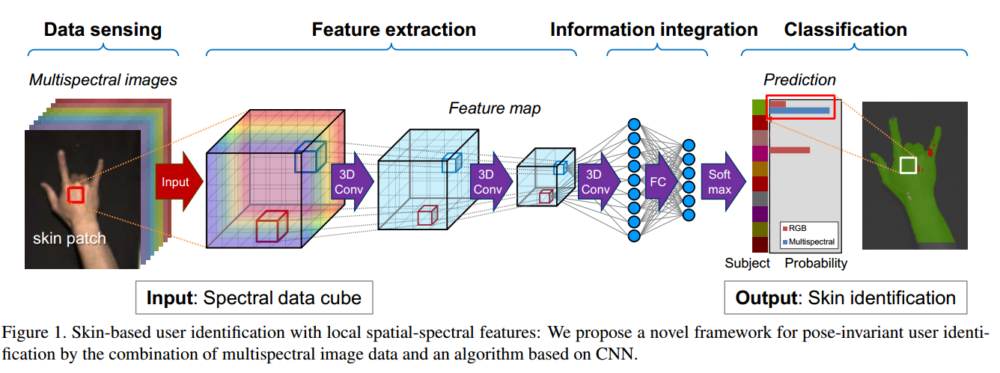

写在前面：此文发于CVPR2019，欢迎在文末留言交流。

[//]:，并公布了[代码](https://github.com/JiaRenChang/PSMNet)

题目：Skin-based identification from multispectral image data using CNNs
作者：Takeshi Uemori1 Atsushi Ito2 Yusuke Moriuchi2 Alexander Gatto1 Jun Murayama2
1Sony Europe B.V., Stuttgart, Germany 2Sony Corporation, Tokyo, Japan

<!--more-->

作者提出一种仅利用一块皮肤的高光谱图像进行生物识别的方法，是“首个使用手掌描述了位姿不变和对遮挡鲁棒的实时人体识别系统”。

根据文献中的光学考虑，感知到的颜色主要由真皮散射、黑色素和血管吸收组成，由于皮肤生色团浓度的不同，这些颜色在个体之间是不同的。

利用手的一个Patch(16*16)，作者的CNN模型可以对注册用户进行识别，而不使用手的形状作为额外信息。此模型也可以分辨左手右手+实时。

此外，作者探究了马赛克阵列光谱相机中 光谱与空间维度的trade-off。即在固定三维体积(光谱+空间)的情况下，如何分配光谱与空间分辨率使得分类的准确性最高。然而在实际中很难找到总分辨率相同但马赛克分辨率不同的相机，所以这个探究实验是仿真的。

### 识别网络

### WideResNet
作者使用了Wide-ResNet作为base network,在此网络的基础上，作者加入了spectral attention.

#### SE-Block

介绍SE-Block.

SEblock就是给不同通道赋不同的权重，具体操作是对U做squeeze（global average pooling，size=W*H），得到一维向量（长度为C），然后做excitation（类似RNN中的门机制，学习参数W来建立通道相关性），得到的结果作为U中C个channel的权重做scale。其目的是学习每个通道的重要程度，增强有用的特征抑制无用的特征(Selectively enhance useful features and suppress less useful ones )

#### 作者提出的网络结构
相比于原始的WideResNet,作者增加了SE-Block模块并且使用3D卷积替代2D卷积。网络结构没什么说的。

### 数据生成

作者生成两个数据集，data#1,data#2.用来仿真和验证，感觉数据集的制作也是很大的一个贡献，如何设计实验验证自己的idea。

### Reference
[【深度学习从入门到放弃】Squeeze-and-Excitation Networks)](https://zhuanlan.zhihu.com/p/29812913)

