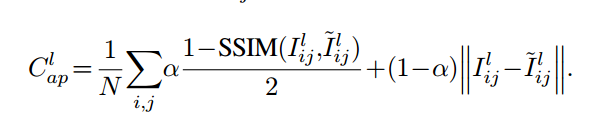

写在前面：此文发于CVPR2017，并在[项目主页](http://visual.cs.ucl.ac.uk/pubs/monoDepth/)公布了代码。
本文中文翻译：[读Unsupervised Monocular Depth Estimation with LeftRight Consistency](https://zhuanlan.zhihu.com/p/29528596)
代码中文解读：[[读源码] Unsupervised Monocular Depth Estimation with Left-Right Consistency](https://zhuanlan.zhihu.com/p/29664269)
关于近几年单目深度估计的文章，可以参考[知乎用户的回答](https://www.zhihu.com/question/53354718/answer/207687177)。

题目：Unsupervised Monocular Depth Estimation with Left-Right Consistency
作者：Clement Godard     Oisin Mac Aodha     Gabriel J. Brostow
University College London

<!--more-->

### 背景
#### motivation

思考：人眼可以做到单目的原因是什么？

回答：人眼单目深度估计是基于极强的先验，这也限制了单目深度估计的应用场景。

“利用图像重建误差（image reconstruction loss）来最小化光度误差（类似于SLAM中的直接法）虽可以得到很好地图像重建结果（disparity），但得到深度预测结果非常差。”（不太了解SLAM直接法是什么）

本文主要讲无监督学习的方式估计深度。基本思想基于立体匹配中的左右一致性，即将一幅图warp到另一幅图定义loss。

保留问题：

- 单目无监督深度的开山作是Depth Map Prediction from a Single Image using a Multi-Scale Deep Network（NIPS2014），第一篇CNN-based来做单目深度估计的文章。

#### other works
- Deep3d: Fully automatic 2d-to-3d video conversion with deep convolutional neural network(ECCV2016),J. Xie, R. Girshick, and A. Farhadi.计算出每个像素的视差的概率分布，对像素所在行的所有视差进行加权求和，权重即为概率。
- Unsupervised CNN for single view depth estimation: Geometry to the rescue.(ECCV2016),R. Garg, V. Kumar BG, and I. Reid. 

### 贡献

- 新的loss，end2end的unsupervised monocular depth estimation网络
- 应用在了新的数据集上
- 对train loss和图像生成模型进行了评估。图像生成模型是指生成视差图的模型。

### 主要内容

网络结构：

encoder-decoder结构，包括长skip。通过一个带scale的sigmoid函数，将输出限制在(0,0.3*当前scale下的图像宽度)。 
作者采用的激活为ELU（参看深度学习(1)-深度学习中的核函数（激活函数））。 
decoder结构中，作者没有用广泛采用的deconvolution结构，而是用一个最近邻升采样+后续的卷积层的方式来做分辨率提升。 
作者采用Adam模式（参见cs31n_lesson6_7/5.调参）来进行训练。

和一般视觉深度学习训练一样，数据增强（data augmentation）是必要的。

作者也尝试将encoder替换成Resnet50，而其他部分不变。 

LOSS：

$$
C_s=\alpha_{ap}(C^l_{ap}+C^r_{ap})+\alpha_{ds}(C^l_{ds}+C^r_{ds})+\alpha_{lr}(C^l_{lr}+C^r_{lr})
$$

 - $C_{ap}$:纹理loss，与输入图像纹理相关。

$\alpha=0.8$
$C_{ap}$来自于Loss Functions for Neural Networks for Image Processing,也是主要起作用的部分！

- $C_{ds}$:平滑loss

直观理解，原图I梯度越大的地方，要求视差图d梯度越大；原图I梯度越小的地方（平滑），允许视差图d梯度越小（平滑）。

- $C_{lr}$:左右一致性loss

[//]:

#### 速度

35 ms for a 512*256 image on one modern GPU

#### 吐槽
【作者在估计深度的过程中确实没有用到激光或者结构光的GT，但仍需要已知基线和焦距的双目图像对作为训练输入，测试时只需将单张图作为输入。感觉monocular有点牵强】

#### 补充阅读

- Dispnet & FCN，本文使用的网络结构
- STN ，作者warp图像的主要方式
- 本文提到另一个工作DeepStereo：从多个邻近视角选取像素合成新视角的图像。Deepstereo: Learning to predict new views from the world’s imagery. (CVPR2016)J. Flynn, I. Neulander, J. Philbin, and N. Snavely. 

### Reference
[论文笔记-深度估计(5)Unsupervised Monocular Depth Estimation with Left-Right Consistency](https://blog.csdn.net/Kevin_cc98/article/details/78945802)

