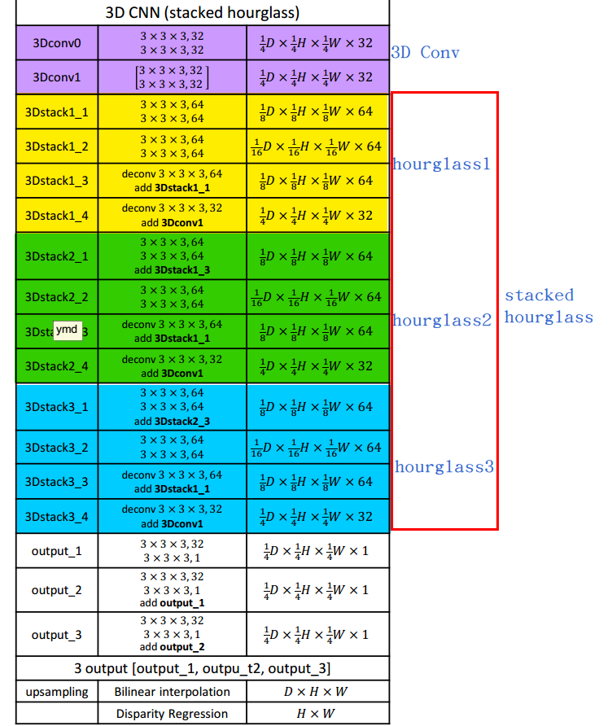

写在前面：此文发于CVPR2018，并公布了[代码](https://github.com/JiaRenChang/PSMNet)

题目：Pyramid Stereo Matching Network
作者：Jia-Ren Chang, Yong-Sheng Chen
Department of Computer Science, National Chiao Tung University, Taiwan

<!--more-->

### 背景
#### motivation
立体匹配通用难点：occlusion areas,repeated patterns,textureless regions,reflective surfaces.
本文主攻方向：单独使用intensity-consistency导致在纹理区域表现不佳，现有立体匹配框架多基于patch-based Siamese结构且缺少context信息。
从全局context信息中提取regional support.

#### other works
- MC-CNN
- Displets: utilizes object information by modeling 3D vehicles to resolve ambiguities in stereo matching.
- ResMatchNet: learns to measure reflective confidence for the disparity maps to improve performance in ill-posed regions.
- GC-Nets: employs the encoder-decoder architecture to merge multiscale features for cost volume regularization.

### 贡献
- 提出一个无后处理的end2end的立体匹配学习框架
- 引入pyramid pooling模块使提取的图像特征包含全局context信息
- 提出 堆栈沙漏式的3D-CNN ，去扩展cost volume时的局部的上下文信息
- 在KITTI刷到了state-of-the-art（目前被M2S_CSPN等挤下去了，在stereo2012/2015分别排名8/20 截止2018.10.18）

### 主要内容
提出PSM-Net，包括两个主要模块，spatital pyramid pooling 和3D-CNN.
spatial pyramind pooling 在不同尺度和位置聚合了全局context信息，并形成cost volume
3D-CNN使用stacked mutiple hourglass结构(来源：[Stacked Hourglass Networks for Human Pose Estimation,ECCV2016](http://www-personal.umich.edu/~alnewell/pose/))标准化cost volume并链接中间的监督。

#### 网络结构



#### 相关工作
本文主要借鉴了两种提取全局上下文信息的网络结构：[hourglass](https://arxiv.org/abs/1603.06937) 和 [pyramid pooling](https://arxiv.org/abs/1406.4729).
两种结构均有大量相关的工作。

### Reference
[Pyramid Stereo Matching Network](https://arxiv.org/abs/1803.08669)

